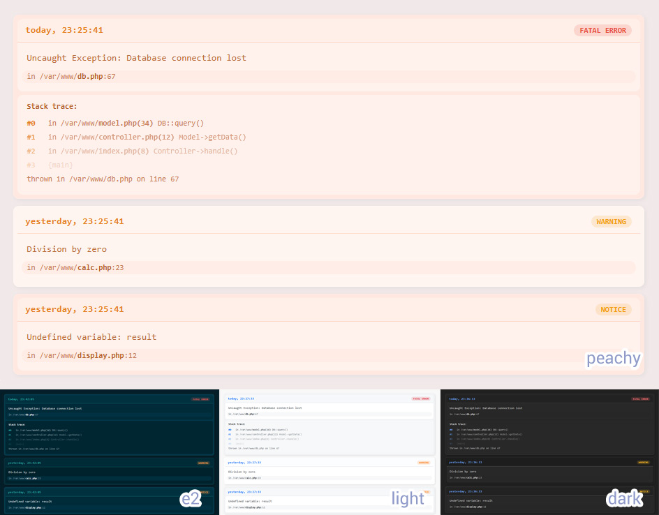
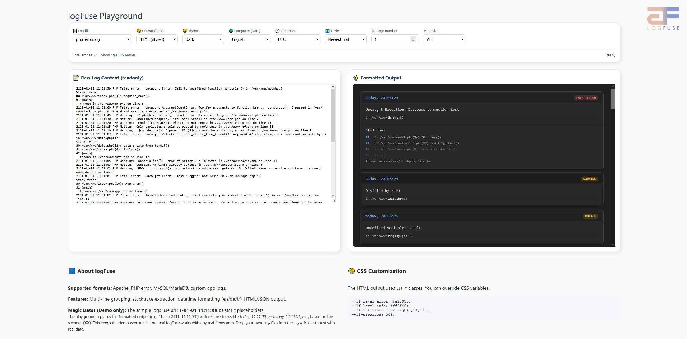

[](LICENSE)

# logFuse – because errors are beautiful

**Making mistakes is beautiful. Learning from them even more so.**  
logFuse turns your messy, screaming error logs into clean, structured output – **HTML** for humans, **JSON** for machines.

> ⚡ **Not just a pretty printer** – logFuse parses, groups, and structures your logs so you can use them anywhere: on screen, in APIs, or in your data pipeline.

---

<br><br>
◤◤◤ Quick Example

```php
use e2\logFuse;

$log = new logFuse();
$log->addFile('/var/log/apache/error.log')
    ->setLanguage('en')
    ->setOrder('desc')
    ->setPagination(1, 50);

echo $log->getOutput('html');   // beautiful, themed HTML
echo $log->getOutput('json');   // structured JSON for APIs
```

One class. Two outputs. Your choice.

<br><br>
◤◤◤ HTML MODE – for humans

When you need to **see, understand, and debug** – right in your browser


**🎨 4 built‑in themes**

| Theme    | Vibe                         |
|----------|------------------------------|
| `peachy` | warm, soft, friendly         |
| `light`  | clean, bright, clinical      |
| `dark`   | night mode, easy on eyes     |
| `e2`     | original techno style        |


```php
echo logFuse::getCss('dark');
```

**✨ Full CSS customisation**

Don't like the colours? Override CSS variables:

```css
:root {
  --lf-rgb-level-error: 255, 80, 80;
  --lf-rgb-datetime-color: 0, 200, 180;
  --lf-rgb-bg-base: 20, 20, 30;
}
```

Want complete control? The HTML uses clean, semantic .lf-* classes – write your own CSS from scratch.

```html
<ul class="lf-list">
  <li class="lf-entry error">
    <div class="lf-header">...</div>
    <div class="lf-message">...</div>
    <div class="lf-stacktrace">...</div>
  </li>
</ul>
```

**🧠 What you get in HTML**

- Coloured log levels (error, warning, info)
- Human‑readable, localised dates
- File names and line numbers highlighted
- Stack traces with progress indicators
- Responsive layout – works on desktop and mobile





<br><br>
◤◤◤ JSON MODE – for machines

When you need to **feed logs into APIs, databases, or monitoring systems**.

**📦 Structured output**

Each log entry becomes a clean, predictable object:


```json
[
  {
    "datetime": "2025-04-18 14:32:11",
    "level": "error",
    "message": "Uncaught Exception: PDOException...",
    "file": "/var/www/app.php",
    "line": 42,
    "stacktrace": [
      "#0 /var/www/db.php(23): PDO->prepare()",
      "#1 /var/www/index.php(12): require_once()"
    ]
  }
]
```
No regex. No guesswork. Just **ready-to-use JSON**.

**🚀 Real‑world use cases**

| Use case | How logFuse helps |
|----------|-------------------|
| **REST API** | Return parsed error logs as JSON endpoint |
| **Database storage** | `INSERT` structured logs into PostgreSQL, MySQL, MongoDB |
| **Centralised logging** | Forward JSON to ELK, Datadog, Loki, or Splunk |
| **Alerting** | Count errors per hour, trigger alerts on fatal issues |
| **Automated analysis** | Find most common stack traces, error frequencies |


> 💡 *"JSON output turns logFuse into a data pipeline component – not just a viewer."*


<br><br>
◤◤◤ Playground – learn by doing




The `playground/` folder contains a **live demo** with sample log files.

> **Note:** The playground adds handy placeholders like `{{TODAY}}`, `{{YESTERDAY}}`, `{{DAYS_AGO:N}}` – these are **demo‑only** to keep examples fresh. They are **not** part of the logFuse class itself.

Open `playground/index.php` and:

- Pick a sample log file  
- Switch between HTML and JSON output  
- Change themes, language, pagination  
- See parsed output instantly  

**No database. No setup. Just beautiful errors.**


<br><br>
◤◤◤ Installation

**No Composer required** – copy `src/logFuse.php` into your project.


<br><br>
◤◤◤ Requirements

- PHP ≥ 8.1


<br><br>
◤◤◤ Making mistakes is beautiful – really

Every error log is a story. Something went wrong, and now you get to fix it.  
logFuse helps you read that story with clarity, colour, and structure – whether on screen or in your data pipeline.

> 💡 *“Errors are not failures. They are lessons dressed in red – and JSON.”*


