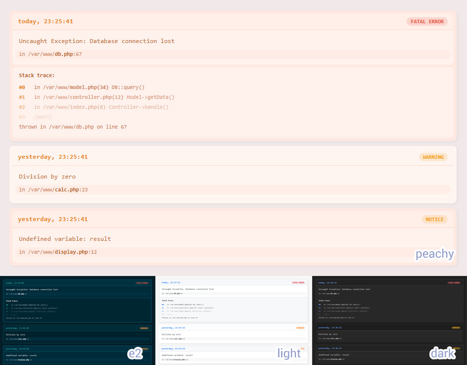
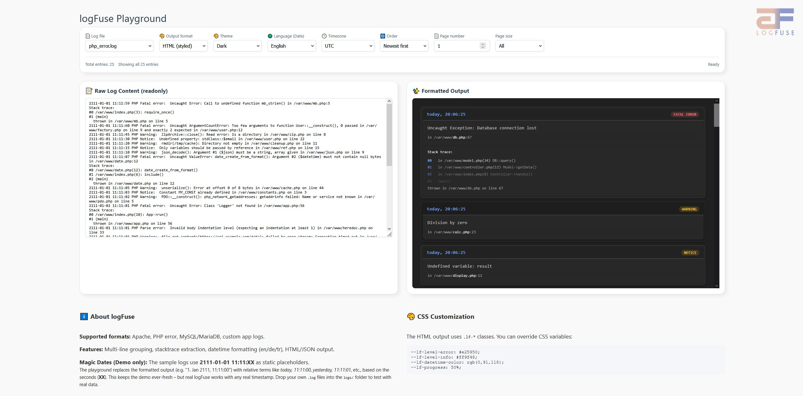

[](LICENSE)

# logFuse – because errors are beautiful

**Making mistakes is beautiful. Learning from them even more so.**
logFuse turns your messy, screaming error logs into clean, structured output – **HTML** for humans, **JSON** for machines.

> ⚡ **Not just a pretty printer** – logFuse parses, groups, and structures your logs so you can use them anywhere: on screen, in APIs, or in your data pipeline.

---

<br><br>
## Quick Example

```php
use e2\logFuse;

$log = new logFuse();
$log->addFile('/var/log/apache/error.log')
    ->setLanguage('en')
    ->setOrder('desc')
    ->setPagination(1, 50);

echo $log->getOutput('html');   // beautiful, themed HTML
echo $log->getOutput('json');   // structured JSON for APIs
```

One class. Two outputs. Your choice.

<br><br>
<<<<<<< HEAD
## 🚀 High‑Performance Index Mode (for huge log files)

When working with **multi‑gigabyte log files**, logFuse automatically builds a persistent **byte‑offset index** – so it only reads the entries you actually need for the current page.

- **No full file scan** – Index stores entry start positions.
- **Perfect for DESC pagination** – Newest page is read directly from the end of the file.
- **Index is cached** – Reused as long as the log file does not change (size / mtime).
- **Custom cache directory** – Use `setIndexDirectory()` to control where indexes are stored.

```php
$log = new logFuse();
$log->setIndexDirectory('/tmp/logfuse_cache')   // optional, default: sys_get_temp_dir()
    ->addFile('/var/log/huge-error.log')
    ->setPagination(1, 100)
    ->setOrder('desc');

// Only the 100 entries of page 1 are read from disk – memory usage stays low
echo $log->getOutput('html');
```

To force a rebuild of the index (e.g., after manual log file manipulation):

```php
$log->clearIndexCache();
```

When using `addFileContent()` with dynamic content, you can provide a **stable ID** to keep the index cached across requests:

```php
$log->addFileContent($dynamicLog, 'my_custom_id_v1');
```

<br><br>
=======
>>>>>>> dd4112ce19b61b9cceabed5ecc6f3fb9e47db878
## HTML MODE – for humans

When you need to **see, understand, and debug** – right in your browser

**🎨 4 built‑in themes**

| Theme    | Vibe                         |
|----------|------------------------------|
| `peachy` | warm, soft, friendly         |
| `light`  | clean, bright, clinical      |
| `dark`   | night mode, easy on eyes     |
| `e2`     | original techno style        |

```php
echo logFuse::getCss('dark');
```

**✨ Full CSS customisation**

Don't like the colours? Override CSS variables:

```css
:root {
  --lf-rgb-level-error: 255, 80, 80;
  --lf-rgb-datetime-color: 0, 200, 180;
  --lf-rgb-bg-base: 20, 20, 30;
}
```

Want complete control? The HTML uses clean, semantic .lf-* classes – write your own CSS from scratch.

```html
<ul class="lf-list">
  <li class="lf-entry error">
    <div class="lf-header">...</div>
    <div class="lf-message">...</div>
    <div class="lf-stacktrace">...</div>
  </li>
</ul>
```

**🧠 What you get in HTML**

- Coloured log levels (error, warning, info)
- Human‑readable, localised dates (en, de, tr)
- File names and line numbers highlighted
- Stack traces with progress indicators
- Responsive layout – works on desktop and mobile



<br><br>
## JSON MODE – for machines

When you need to feed logs into APIs, databases, or monitoring systems.

### 📦 Structured output

Each log entry becomes a clean, predictable object:

```json
[
  {
    "datetime": "2025-04-18 14:32:11",
    "level": "error",
    "message": "Uncaught Exception: PDOException...",
    "file": "/var/www/app.php",
    "line": 42,
    "stacktrace": [
      "#0 /var/www/db.php(23): PDO->prepare()",
      "#1 /var/www/index.php(12): require_once()"
    ]
  }
]
```

No regex. No guesswork. Just **ready-to-use JSON**.

<br><br>
## 🚀 Real‑world use cases

| Use case | How logFuse helps |
|----------|-------------------|
| **REST API** | Return parsed error logs as JSON endpoint |
| **Database storage** | `INSERT` structured logs into PostgreSQL, MySQL, MongoDB |
| **Centralised logging** | Forward JSON to ELK, Datadog, Loki, or Splunk |
| **Alerting** | Count errors per hour, trigger alerts on fatal issues |
| **Automated analysis** | Find most common stack traces, error frequencies |

> 💡 *“JSON output turns logFuse into a data pipeline component – not just a viewer.”*
<<<<<<< HEAD
=======


>>>>>>> dd4112ce19b61b9cceabed5ecc6f3fb9e47db878

<br><br>
## Tabular Data Sources (CSV, SQLite, MySQL)

logFuse can read logs directly from **databases** and **CSV files** – perfect for existing log tables.

```php
// From a SQLite table with columns: log_time, log_level, log_message
$log->addTabularSource('sqlite:/var/log/app.db:logs', ['log_time', 'log_level', 'log_message']);

// From a CSV file with header row
$log->addTabularSource('/var/log/export.csv', ['datetime', 'level', 'message'], ['csv_header' => true]);

// From any iterable data (e.g. PDO statement, array) with custom formatter
$log->addTabularData($myRows, fn($row) => "[{$row['date']}] {$row['severity']}: {$row['text']}");
```

The same parsing, grouping, and formatting applies – your database logs become instantly readable.

<<<<<<< HEAD
<br><br>
## 🐛 Debug Mode

Enable debug mode to see exactly how logFuse parses your logs, builds the index, and applies pagination.

```php
$log = new logFuse(['debug' => true]);
$log->addFile('/var/log/error.log');
// ... set pagination, order, etc.
echo $log->getOutput('html');

// Output debug log as HTML comment (in HTML mode) or as extra "_debug" key (in JSON mode)
$log->getDebug('output');   // prints to screen
$log->getDebug('log');      // writes to error_log
```

In the **Playground**, append `?debug=1` to the URL to see the internal debug output.
=======

>>>>>>> dd4112ce19b61b9cceabed5ecc6f3fb9e47db878

<br><br>
## Timezone Support

Log timestamps without timezone info? No problem. Set the default timezone in the constructor:

```php
$log = new logFuse(['timezone' => 'Europe/Berlin']);
```

All dates will be parsed and displayed consistently.

<<<<<<< HEAD
=======


>>>>>>> dd4112ce19b61b9cceabed5ecc6f3fb9e47db878
<br><br>
## Playground – learn by doing



The `playground/` folder contains a **live demo** that showcases all logFuse features.

<<<<<<< HEAD
> **Note about Magic Dates:** The demo logs use special timestamps like `2111-01-01 11:11:XX` (XX = second).
> These are **static placeholders** that the playground replaces with relative terms (today, yesterday, …) at display time.
> This keeps the demo evergreen – you always see “today”, “yesterday”, etc., no matter when you run it.
=======
> **Note about Magic Dates:** The demo logs use special timestamps like `2111-01-01 11:11:XX` (XX = second).  
> These are **static placeholders** that the playground replaces with relative terms (today, yesterday, …) at display time.  
> This keeps the demo evergreen – you always see “today”, “yesterday”, etc., no matter when you run it.  
>>>>>>> dd4112ce19b61b9cceabed5ecc6f3fb9e47db878
> The real logFuse class works with any real timestamp; the magic date trick is only for the playground.

**What the playground demonstrates:**
- Parsing of Apache, PHP, MySQL, and custom logs
- Switching between HTML and JSON output
- Changing themes, language (en/de/tr), timezone, and order
- Pagination (page size and page number)
- Reading from SQLite (standard 3‑column table) and CSV files
- Automatic replacement of magic dates with relative terms
<<<<<<< HEAD
- **Debug mode** – add `?debug=1` to see logFuse internals
=======
>>>>>>> dd4112ce19b61b9cceabed5ecc6f3fb9e47db878

Open `playground/index.php` and try it yourself.

**No database. No setup. Just beautiful errors.**

<<<<<<< HEAD
=======


>>>>>>> dd4112ce19b61b9cceabed5ecc6f3fb9e47db878
<br><br>
## Installation

**No Composer required** – copy `src/logFuse.php` into your project.

<<<<<<< HEAD
=======


>>>>>>> dd4112ce19b61b9cceabed5ecc6f3fb9e47db878
<br><br>
## Requirements

- PHP ≥ 8.1

<<<<<<< HEAD
=======


>>>>>>> dd4112ce19b61b9cceabed5ecc6f3fb9e47db878
<br><br>
## Making mistakes is beautiful – really

Every error log is a story. Something went wrong, and now you get to fix it.
logFuse helps you read that story with clarity, colour, and structure – whether on screen or in your data pipeline.

> 💡 *“Errors are not failures. They are lessons dressed in red – and JSON.”*

<br>
<<<<<<< HEAD
<br>
=======
<br>
>>>>>>> dd4112ce19b61b9cceabed5ecc6f3fb9e47db878
